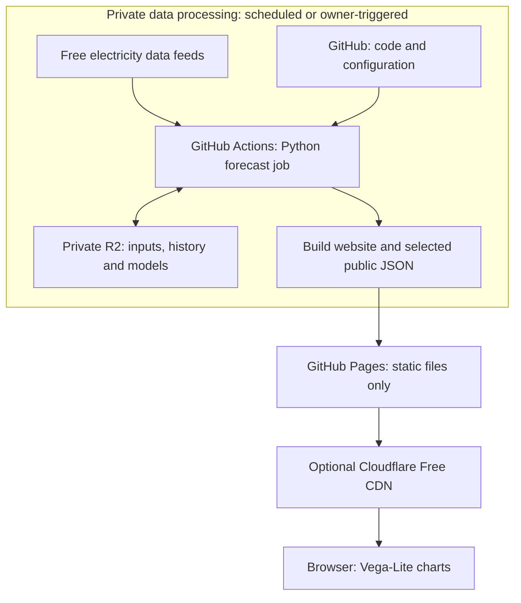

# Proposed architecture

Revised 18 September 2026. This is a proposal based on the existing experiments; the hosted service and the cost controls below have not yet been built or configured.

The historical results and code referenced here belong to the separate initial research archive. [RESEARCH.md](RESEARCH.md) locates that evidence. This new repository begins with the design documents; application code will be introduced in small steps.

**The basic idea**

**Popularity affects static bandwidth, not metered compute or storage API calls.** Visitors receive a website and small, precomputed data files from GitHub Pages, optionally through Cloudflare's Free CDN. They cannot trigger a forecast, a Worker, or an authenticated R2 request. This separation must remain true even when the cache misses or someone requests an invalid URL.

GitHub holds the instructions. GitHub Actions periodically runs the Python forecasting program. Private Cloudflare R2 storage remembers the data and fitted models between runs. The job then publishes only the files needed by the website to GitHub Pages. A million visitors therefore cause the same scheduled forecasting and R2 work as one visitor.

Think of R2 as a private cupboard of files. Each Actions run takes out the few files it needs, does its calculations, puts the new results back, and shuts down. DuckDB helps organise the tables inside that temporary job. There is no database server to administer.

The initial product is a half-hourly Agile import-price forecast for the next 72 hours, updated approximately hourly. It starts with Region G, matching our experiments, in p/kWh including VAT and excluding standing charges. Already published Octopus prices are distinguished from predictions.

The arrows show data flowing towards the visitor. A browser request travels back only as far as the CDN or GitHub Pages; it never reaches the scheduled job or R2. Without a custom domain, the browser can use the free `github.io` address directly. With a domain you already own, the Free CDN can reduce traffic reaching Pages. Domain registration/renewal is a separate existing cost.

**The technology and its job**

| Component | Recommendation | What it does |
|---|---|---|
| Source repository | A public GitHub repository for the simplest free setup | Holds code, configuration, tests and lockfiles. Private datasets and model binaries stay in R2. |
| Scheduled computation | GitHub Actions, standard Linux runner | Collects updates and forecasts hourly; refits models weekly. |
| Forecasting program | Existing Python 3.12 project, installed with `uv` | Uses pandas, NumPy, CatBoost, LightGBM and scikit-learn. Preserve the tested dependency versions. |
| Table processing | DuckDB and Parquet | DuckDB joins and filters data inside a run. Parquet stores compressed tables between runs. |
| Durable storage | Cloudflare R2 Standard storage | Stores private inputs, fitted models and forecast history. Python accesses it with `boto3`, using R2's S3-compatible interface. |
| Website | Vite, TypeScript, HTML/CSS, Vega-Lite | Presents forecasts and accuracy without running a model in the browser. |
| Website hosting and data access | GitHub Pages | Serves HTML, JavaScript, CSS and precomputed JSON. No server-side code or database queries run for visitors. |
| Optional caching in front | Cloudflare Free CDN on a custom domain | Caches those same static files. Uses no Worker, R2 binding or paid traffic add-on. |

GitHub Free supports Pages from a public repository; Pages from a private repository requires an eligible paid GitHub plan. Public code does not make Actions secrets or the private R2 bucket public, but logs and uploaded artifacts must be treated as public. If keeping the source private is essential, use an existing eligible plan or a separate public publishing repository; that adds setup complexity. [Pages availability](https://docs.github.com/en/pages/getting-started-with-github-pages/creating-a-github-pages-site).

Python accesses R2 through its S3-compatible interface, but that happens only in trusted Actions jobs. Cloudflare's Free website plan includes the CDN; its cache is separate from the R2 storage product. [Python/R2 example](https://developers.cloudflare.com/r2/examples/aws/boto3/), [Cloudflare plans](https://www.cloudflare.com/plans/).

**Where the information comes from**

| Source | Information | Role in the proposed service |
|---|---|---|
| Octopus public tariff API | Published half-hourly Agile rates and tariff/product details | Supplies known prices and the eventual answers used to score and train the model. Maintain the correct tariff and regional mapping as products change. |
| NESO embedded wind and solar forecasts | Expected generation connected to local distribution networks | Existing model inputs. These do not cover all UK wind generation. |
| NESO Daily OPMR | Demand, available generation capacity and related system conditions | Existing model inputs describing how tight electricity supply is likely to be. |
| NESO 2–14-day demand forecasts | Daily forecast points and a current half-hourly demand curve | The tested model uses a curve reconstructed from archived daily points. Collect the native half-hourly curve too and evaluate it alongside the reconstruction. |
| Calendar, calculated locally | Time of day, weekdays, seasons and bank holidays | Existing inputs; no network feed needed. Separate Christmas/Easter features were tested but are not in the preferred candidate. |
| NESO transmission-connected wind forecast | Forecast output from large grid-connected wind farms | Collect for a future candidate. It is not yet a demonstrated improvement or a dependency of the preferred model. |
| NESO/Elexon realised demand and generation | What demand and generation subsequently turned out to be | Evaluation data for diagnosing input-forecast errors. Future actuals must never enter a forecast made earlier. |
| ENTSO-E, optionally | Initially, recent French nuclear generation | An experimental addition once API access works and applicable usage rights are established. The last recorded access attempts were rejected, so the initial service does not depend on it. |

These are public institutional sources rather than paid feeds or scraped commercial dashboards. Our current candidate does not require a separate weather API: it receives weather's effects through the electricity-demand and renewable-generation forecasts. Optional gas-price and additional plant-availability experiments also remain outside the default model.

The existing [source and licensing review](DATA_LICENSING.md) links to the provider datasets and terms. Free access does not imply unrestricted republication. Keep the mixed input archive private, carry the notices in [DATA_ATTRIBUTION.md](DATA_ATTRIBUTION.md), and expose only selected website outputs. Public bulk redistribution of Octopus tariff history and prospective ENTSO-E nuclear data remains unresolved; these should not become downloadable website datasets by accident. Private storage does not override a provider's usage conditions.

**What we save, and why**

The most valuable history is **what we knew when we made each forecast**. A corrected historical demand series cannot tell us what yesterday's demand forecast said. Saving successive versions lets us distinguish a bad input forecast from a bad price model, and test future improvements honestly.

Use **one private R2 bucket** for source records, model inputs, outcomes, forecast history, fitted models and small index files. Disable both the public `r2.dev` endpoint and any R2 custom-domain exposure. Do not publish signed R2 URLs or connect the bucket to a public Worker.

The website's data is a separate **static deployment artifact**, generated inside Actions. It contains only selected forecast JSON and aggregate accuracy JSON, alongside the built HTML, JavaScript and CSS. It is uploaded to GitHub Pages, not served from R2. Build it in a clean directory using an explicit file allowlist; never upload the checkout or the private working directory wholesale.

Within R2, store dated files and monthly Parquet partitions, with a small `current.json` index pointing to the complete current model and working state. Do not keep a live DuckDB/SQLite database open against an R2 object: download files, work locally, then upload completed files.

| Dataset | What to retain | Why it matters |
|---|---|---|
| Source forecast versions and observations | Long-term compressed records of the selected source series, including issue times, first-seen times, target periods and revisions. | Preserves inputs that providers may overwrite; supports new features and fair historical evaluation. |
| Exact model input rows | Every issued forecast's inputs, with source references and transformation version. Keep at least 400 days readily available for weekly training. Archive older rows. | Reproduces the existing model and preserves what was available at each decision. |
| Official price outcomes | Long-term prices, region, tariff/product, units and when we observed publication. | Training answers and forecast scoring. |
| Issued forecasts | Every version, including issue time, target interval, model version, known/predicted status, fallback status and comparison predictions. | An honest accuracy record; a new forecast must not replace an older one for the same target. |
| Recent error-correction state | A small working file covering at least the previous seven days; retain the underlying prediction/outcome records long-term. | Updates the correction for recent over- or underprediction. |
| Realised demand and generation | Selected actual series with provenance and observed revisions. | Allows hindsight experiments to investigate where errors come from. |
| Fitted models and their metadata | Current and previous bundles for rollback; keep metadata and reproducible training-data references long-term. | Fast inference and recovery. Avoid accumulating every weekly model binary indefinitely. |
| Provider responses and operational records | Deduplicated raw responses for a rolling period, initially 30 days; preserve selected normalised data, hashes, schema/licence records and run summaries longer. | Debugging and audit without storing a full bulk download every hour. |

Record both the provider's issue time, when supplied, and when our collector first saw the data. Store interval timestamps in UTC and display Europe/London time, handling clock changes explicitly. Downloading a historical revision today must not make it appear available to an earlier forecast.

Keep an occasional independent local backup of the durable archive. GitHub's dependency cache and temporary workflow artifacts are useful conveniences, but the source of truth is R2.

**What happens on each forecast run**

1. Actions checks out the code and restores the locked Python environment.
2. It reads R2's current index and downloads the fitted model, recent input records and recent error-correction state.
3. It fetches new provider data and newly published Octopus prices, recording when they were observed. Unchanged responses are deduplicated.
4. It checks coverage, units, timestamps and freshness, then constructs the half-hourly model inputs. It uses the documented fallback where an optional input is missing; it must not silently invent a fresh input.
5. It generates predictions, keeps published prices separately marked, and scores older forecasts whose answers are now available.
6. It saves the new issue and input snapshot in private R2 and updates the current index only after all referenced files are complete.
7. It exports the selected public JSON, assembles a complete static website artifact, checks its contents and size, and deploys it to GitHub Pages. Publishing failure leaves the previous site available; the completed forecast can be republished without rerunning the model.

Use GitHub's Pages artifact/deployment actions rather than committing generated files every hour. Build the Vite app reproducibly; optionally reuse its compiled assets when the code and lockfile have not changed. Each deployment still includes the whole small site with the latest JSON. Website traffic never triggers these jobs. [Custom Pages workflows](https://docs.github.com/en/pages/getting-started-with-github-pages/using-custom-workflows-with-github-pages).

The job's data requirements are deliberately small:

| Needed for an hourly forecast | Where it comes from |
|---|---|
| Current fitted models, feature definitions and model version | R2 model bundle plus repository code/configuration |
| Recent source versions needed for lags, forecast revisions and freshness checks | A compact R2 working set, extended by new provider downloads |
| Current demand, wind, solar and capacity forecasts covering the target intervals | Provider feeds, with permitted cached fallbacks |
| Already published tariffs and newly available outcomes | Octopus API plus a recent R2 price buffer |
| Original recent reference forecasts and their completed outcomes | R2 error-correction state |
| Calendar features and tariff/region settings | Local calculation and configuration |

An hourly inference run does **not** need to download the full training or research archive. The weekly fitting run additionally reads the 400-day daily input/label checkpoint, enough for the longest 365-day training window plus scheduling buffer. It fits a new bundle, checks it, and promotes it only on success. Load model files only from our trusted state store.

Keep a dedicated daily **16:30 Europe/London reference forecast**, alongside hourly issues, because the existing experiments and error correction use this cadence. Do not give 24 overlapping hourly forecasts 24 times the influence in the correction. Record the real issue time if a scheduled run is delayed; do not manufacture an on-time forecast using later information.

Use one writer at a time across collection and training, and prevent an older run from deploying over a newer forecast. Upload versioned files first and switch the small index last, retaining the previous good version. Retries should recognise an already completed run. A failed update leaves the last successful forecast visible. The browser calculates its age from the saved issue time and displays a stale indicator without contacting a backend.

GitHub schedules can run late or be missed. Schedule the routine refresh away from the start of the hour, and provide a manual rerun. This suits an approximately hourly forecast, without promising exact hourly delivery. [GitHub schedule behaviour](https://docs.github.com/en/actions/reference/workflows-and-actions/events-that-trigger-workflows#schedule).

**The forecasting model**

Use the existing **level/shape model with recent-error correction** as the initial candidate. It combines several tree-based statistical models. Trees learn relationships such as “a high demand forecast with little wind and limited spare capacity tends to mean a higher price.” They are inexpensive to fit and run.

The calculation has three stages:

1. Combine five forecasts by taking their median: two reproduced AgilePredict recipes and three models with richer demand-profile inputs. They learn from different recent history windows.
2. Blend the resulting within-day pattern equally with a CatBoost model trained on a year of history. Re-centre that pattern to preserve the original ensemble's average price level over the forecast window.
3. Adjust that level using half the previous three days' completed short-horizon mean error, capped at ±4 p/kWh. If recent forecasts were too high, this pulls the new forecast down.

This last stage is already the practical version of the suggested autoregressive correction. Slightly different corrections produced only tiny further gains, so the simple three-day version remains the default. [Candidate implementation](RESEARCH.md), [autoregression experiments](RESEARCH.md).

| Aspect | Inspected AgilePredict recipe | Our proposed candidate |
|---|---|---|
| Main technique | Average of CatBoost, LightGBM and ExtraTrees | Median ensemble, a year-long CatBoost shape model, and recent-error correction |
| Training history | 60-day default in inspected code; 90-day version also reproduced | A mixture of 60, 90 and 180 days, plus the 365-day shape model |
| Demand information in our comparison | Daily peak forecast | Adds a reconstructed within-day demand curve |
| Other inputs | Renewable forecasts, grid conditions and calendar features | Adds demand/capacity relationships, forecast revisions, ramps, seasonal detail and input-age information |
| Holidays | Bank-holiday and weekend effects | Bank holidays and seasonal features; no selected extra Christmas/Easter flags |
| Recent mistakes | No explicit residual correction in the tested recipe | Uses completed recent forecast errors |
| Hosting | Documented Django services and PostgreSQL on Fly.io, with external scheduling | Python in Actions, private files in R2, static GitHub Pages website with optional Free CDN |

The comparison is against upstream commit `505adda5820d91ceb369ca4728116c446567c530`, not a verified description of its current private production configuration. Our reproductions use common reduced inputs, direct retail-price targets and weekly fitting. Preserve the upstream MIT notice with reused code and pin the parameter definitions needed by our adapter. [Upstream audit](RESEARCH.md), [licensing and infrastructure evidence](DATA_LICENSING.md).

Current measured mean absolute error, in p/kWh; lower is better:

| Model | Earlier 375 issue dates | Recent 56 issue dates |
|---|---:|---:|
| AgilePredict recipe, 60 days | 2.932 | 4.446 |
| AgilePredict recipe, 90 days | 2.931 | 4.595 |
| **Our proposed candidate** | **2.628** | **4.352** |

The earlier period is 7 July 2025–16 July 2026; the recent period is 20 July–13 September 2026. That is approximately **10% lower error earlier and 2–5% lower error recently**. The recent uncertainty intervals include improvement and deterioration, and these dates have been reused during model selection. We have not established superiority over the actual live AgilePredict service. [Full comparison and intervals](RESEARCH.md), [saved metrics](RESEARCH.md).

There is an important product boundary: these figures cover daily 16:30 issues and **unknown prices 48–72 hours ahead**, using a complete 48-slot window. The candidate's shape adjustment must not simply be applied to all 144 slots. For the initial 72-hour prototype, use published rates where available, the existing demand-profile ensemble for earlier unknown periods, and the candidate for the complete 48–72-hour window. Validate that combined policy and hourly issuance prospectively; the table does not establish their accuracy.

Initially preserve the reconstructed demand input used in testing. Run the native half-hourly demand version alongside it as an experiment. Collect transmission-wind forecasts and later test them with properly fitted models. More detailed data can help, but replacing an input silently would change the model whose results we are quoting. Keep the two AgilePredict reproductions running locally as comparators; their live service is not a runtime dependency.

**The first model and subsequent training**

Start locally. We already have working local training code, a saved model bundle, and a verified local refit taking about 6.7 seconds. That saved benchmark used a 7 September 2026 training cutoff and is evidence that the calculation works; it is not a newly trained production model. [Existing refit code](RESEARCH.md), [benchmark results](RESEARCH.md).

The first deployment should follow this sequence:

1. **Prepare a local starting dataset.** Reuse the historical inputs and labels already collected, refreshing eligible records to a declared training cutoff. Export the compact 400-day training history, source buffers needed for current features, and available reference-forecast records. Keep their availability times and provenance. Downloading today's actuals cannot reconstruct forecasts that a provider has overwritten.
2. **Fit and check locally.** Train the complete ensemble using the chosen recipe, save a versioned bundle, and run an example forecast through the public JSON exporter. Record the code version, dependencies, feature definitions, training cutoff and data hashes. Preserve the existing experimental training populations when reproducing their results.
3. **Seed R2 once, explicitly.** Upload the checked private starting dataset and manifest in a bounded administrative step. Routine local development does not perform this upload or require its credentials.
4. **Reproduce the first production fit in Actions.** Use the same training function and input snapshot on the Linux runner, checking predictions against the local reference within an agreed numerical tolerance. Save the production bundle in R2. This avoids depending on a model file serialised on macOS being interchangeable with Linux; byte-identical model binaries are not required.
5. **Run hourly inference and weekly refits.** Hourly jobs load the saved bundle and update inputs and predictions. Weekly jobs train a replacement from the rolling history and promote it only after checks pass. A failed refit keeps the previous good model.

Thus, models can be trained both locally and in Actions. Local training is for development, experiments and recovery; Actions performs routine production refits. Weekly fitting updates the parameters of the selected recipe. It does not automatically search for a new model or promote whichever experiment wins that week.

Initial error correction needs an explicit starting policy too. If sufficiently recent, eligible reference forecasts and their completed outcomes are missing, start with zero correction and mark the model as warming up until the required three days are available. Do not invent past live predictions. This initial behaviour must be reported separately from the fully calibrated candidate's accuracy.

**Local development without R2**

The full collection-to-website pipeline must have a local mode. Keep the forecasting, training and export functions independent of storage: a small storage adapter reads and writes ordinary local files during development and R2 objects in production. Both use the same relative file names, manifests and schemas. No local S3 emulator or database server is needed.

| Working on | Data and tools needed | Cloud access needed? |
|---|---|---|
| Charts, layout and interactions | Vite plus small checked-in synthetic JSON examples matching the public schema | None after installing frontend dependencies; no Python or fitted model required |
| A website view of our actual local forecast | Previously exported public JSON, served by the same Vite app | None; editing a chart does not rerun a forecast |
| Training or forecast logic | Python, local historical input files and a saved model when running inference | None once the input snapshot and dependencies are present |
| Refreshing the local input snapshot | An explicitly invoked collector writing to local files | Provider access only; optional source tokens if that source is enabled, but no R2 |
| Production-equivalent static build | The same JSON exporter and Vite build used by Actions, followed by local preview | No R2, GitHub deployment or CDN access |

Store private local state under ignored `runtime_state/local/`. Put only the selected export in `runtime_state/site/`, and serve only that public output alongside the frontend. Never make the private state directory part of the web server's document root. Keep synthetic examples in a separate tracked fixture directory, clearly marked as demonstration data rather than real forecasts or accuracy results.

Use a local configuration by default. Selecting production storage or publishing should require an explicit command/configuration; the presence of R2 environment variables must not silently switch a local command to production. Separate collection from training and inference so an offline replay cannot unexpectedly fetch revised data. Record the actual snapshot cutoff and forecast issue time, rather than relabelling an old forecast as current.

The following are **proposed convenience commands to implement**, not commands available in the current repository:

| Command | Intended behaviour |
|---|---|
| `make dev` | Start Vite using the synthetic example JSON, with automatic updates as frontend files change. |
| `make dev DATA_MODE=local` | Start the same frontend using an existing local forecast export. |
| `make collect-local` | Explicitly refresh provider data into local state, within collection limits. |
| `make train-local` | Fit the selected model from the local historical snapshot and save it locally. |
| `make forecast-local` | Reuse the local model and snapshot to generate predictions and export website JSON; no retraining or downloading. |
| `make preview-local` | Build and serve the complete static artifact locally, matching the Pages build. |

After one-time dependency setup, frontend work should be a single `make dev` command. The full local sequence is to prepare the input snapshot, train once, forecast, then preview. Repeat only the stage affected by a change. Use `uv.lock` for Python, a Node version declaration and an npm lockfile for the frontend. GitHub Actions calls the same underlying commands with the production configuration; it should not contain a second implementation of the model or export logic. [Vite development and build tools](https://vite.dev/guide/), [local production preview](https://vite.dev/guide/static-deploy.html).

A fresh checkout should support frontend development immediately after dependency installation. Full model development additionally needs the private historical starting dataset, supplied explicitly from our existing local archive or a trusted backup. A one-off R2 download can be offered as a convenience, but must not be required on every run. Synthetic site fixtures are not a substitute for training history.

The public JSON schema is the agreement between Python and the frontend. Check both example files and real exports against it, and run an offline local smoke check from input snapshot through model to built site before enabling deployment. Local preview can check the complete static artifact; real GitHub/Cloudflare permissions and cache behaviour still require a separate deployment check.

**Current status:** local research training, historical replay and saved model checks exist. The interchangeable local/R2 storage adapter, production command wrappers, public JSON exporter, frontend and unified local preview still need implementing. Building this local path comes before connecting the scheduler to R2 or Pages.

**Secrets and permissions**

| Secret or setting | Where it belongs |
|---|---|
| R2 access-key ID and secret access key | GitHub Actions secrets, scoped to the single private bucket and required object operations. Available only to the trusted forecasting/state job. |
| `ENTSOE_TOKEN` | GitHub Actions secret, only when that optional collector is enabled. The local `.transparency_token` stays out of Git and uploads. |
| GitHub Pages deployment credentials | GitHub's short-lived workflow token and OIDC, with `pages: write` and `id-token: write` on the deployment job. No long-lived personal token is needed for a single-repository setup. |
| Cloudflare account ID, bucket names, region and endpoint URLs | Ordinary configuration; these identify resources but do not grant access. |
| Cloudflare CDN configuration | Configure DNS and free cache rules in the dashboard. The proposed workflow does not need a Cloudflare deployment or cache-purge token. |

Production R2 credentials live only in Actions, never in the website, CDN or Pages deployment artifact. If local administration needs access, use a separate scoped local credential. Keep all credentials out of logs and saved request URLs. Do not inject R2 or ENTSO-E secrets into the Vite build or its `VITE_*` variables. Secret-bearing workflows run only trusted code from the protected default branch; untrusted pull requests, issues and public web requests cannot start credentialed collection. The Pages deployment job receives only the checked public artifact. [Pages permissions](https://docs.github.com/en/pages/getting-started-with-github-pages/using-custom-workflows-with-github-pages).

**The frontend**

Use **Vite with TypeScript and ordinary HTML/CSS**, starting without a large application framework. Use **Vega-Lite through `vega-embed`** for the charts. This is enough for a forecast page with a date selector, a few controls and an accuracy view. Vite builds the website files; Vega-Lite describes charts using concise specifications. [Vite](https://vite.dev/guide/), [Vega-Lite](https://vega.github.io/vega-lite/), [vega-embed](https://github.com/vega/vega-embed).

Useful initial views are:

- A half-hour price chart showing published prices and predictions distinctly, with hover values and the forecast issue time.
- A day/time heatmap for spotting cheaper periods.
- An accuracy view showing errors by forecast horizon and month, with sample counts and clearly named comparators.
- A clear freshness indicator, including whether the model is using a fallback. Add uncertainty bands once their coverage has been measured from saved forecast errors.

Use **D3 only where a particular interaction or visual design needs custom work** beyond Vega-Lite, for example a bespoke draggable appliance-scheduling display. It need not be a dependency of the first version. [D3 documentation](https://d3js.org/).

The browser reads relative static URLs such as `./data/forecast.json` and `./data/accuracy.json`. Include issue time, target intervals, region, units, known/predicted status, model version and freshness. Bundle the chart libraries with the site. Filtering, chart interactions and any appliance-cost calculations run in the browser on the downloaded data. There is no dynamic `/api` route and no browser request to an electricity provider or R2.

Keep the frequently refreshed data small: the latest 72-hour curve and compact accuracy summaries, not the full historical archive. A visible page can check for updates about every ten minutes, pausing while hidden. Use normal caching and stable URLs rather than a unique cache-busting query on every request. A timestamp in the JSON tells the page whether anything actually changed.

Before public launch, settle which official tariff values and other third-party fields may appear alongside our forecasts. The deployment artifact should contain only the intended outputs and source acknowledgements.

**Caching without adding a metered service**

If using Cloudflare, point a verified custom domain at GitHub Pages and enable the Free proxy/CDN. Keep all Workers routes, R2 public routes and paid traffic products off for this hostname, including Argo and Cache Reserve. The domain's cache misses go to GitHub Pages, never R2.

Cloudflare does not cache HTML or JSON by default. Add free Cache Rules making this site's public HTML and `/data/*.json` eligible for caching, and respect the origin's cache headers. Check the actual Pages headers and refresh behaviour during deployment; set browser caching to respect those headers too. Do not impose a long fixed cache lifetime on changing JSON. Cloudflare documents a two-hour minimum for a Free-plan Edge TTL override, so the design must not assume an arbitrary five-minute override is available. Fingerprinted JavaScript/CSS can be cached longer. [Default caching](https://developers.cloudflare.com/cache/concepts/default-cache-behavior/), [cache settings](https://developers.cloudflare.com/cache/how-to/cache-rules/settings/), [TTL limits](https://developers.cloudflare.com/cache/how-to/edge-browser-cache-ttl/).

Caching reduces GitHub bandwidth but is not the cost boundary. Even an uncached request or a request to the underlying `github.io` host can only retrieve static files. If caching or a free hosting limit causes trouble, the acceptable failure is an older forecast or temporary unavailability, not automatic migration to a paid endpoint.

**What happens if a million people visit?**

There are **zero additional R2 operations, Worker invocations or forecasting runs caused by those visits** in this design. Public hosting uses GitHub Pages and, if enabled, Cloudflare's Free CDN. It does not switch to per-visitor billing when the site becomes popular.

That is protection from traffic-driven charges, not a promise of unlimited availability. GitHub Pages has a **100 GB/month soft bandwidth limit** and may rate-limit or stop serving a site that exceeds its limits. GitHub explicitly suggests a third-party CDN as one possible mitigation. Pages also limits a published site to 1 GB, far above our intended small bundle. [GitHub Pages limits](https://docs.github.com/en/pages/getting-started-with-github-pages/github-pages-limits).

For scale, using illustrative compressed transfer sizes rather than measurements:

| Traffic | Bytes sent if every request reaches GitHub Pages |
|---|---:|
| One million page loads at 500 KB each | About 500 GB |
| One million JSON refreshes at 20 KB each | About 20 GB |

The CDN and browser caches can reduce origin traffic substantially, but the hit rate depends on traffic patterns and is not guaranteed. A million visitors may each make several requests. We should measure the built site's compressed size and actual cache behaviour rather than infer capacity from visitor count alone.

**Storage, running costs and remaining work**

The measured compact package is **43.04 MB**: about 39.15 MB of models, 1.59 MB of input rows, 0.52 MB of price labels, 1.75 MB of daily forecast history and a small correction file. Budget initially **100–150 MB of working state** including a previous model and recent source buffers. This is an estimate for the operational design, not a complete live store already built.

For hourly 72-hour forecasts, the existing compact input/forecast tables are estimated to add roughly **100–150 MB per year**. Extra source series, full raw responses and diagnostic actuals are additional. Deduplication, monthly compression and bounded raw-response retention prevent repeated bulk downloads from dominating storage. [Measured sizes and assumptions](RESEARCH.md), [deployment assessment](RESEARCH.md).

R2 Standard currently includes 10 GB-months of storage, one million Class A operations and ten million Class B operations per month, with free Internet egress. Our scheduled workload should fit within these allowances, allowing for other usage on the account. Your existing Cloudflare account with a card is suitable; enable the R2 subscription if needed. R2 remains metered above its allowance, but public popularity has no effect on its usage here. [R2 pricing](https://developers.cloudflare.com/r2/pricing/), [R2 setup](https://developers.cloudflare.com/r2/get-started/).

With a public repository, standard GitHub-hosted Actions runners are free. Use standard Linux runners, not paid larger runners, and keep artifact/cache storage bounded. If forecasting stays in a private repository, GitHub Free includes 2,000 minutes monthly: hourly jobs at two billed minutes each use 1,488 minutes in a 31-day month before other work. Our local full fit took about 6.7 seconds and inference about 0.05 seconds, but installation, collection and deployment time on a Linux runner remain unmeasured. [GitHub Actions billing](https://docs.github.com/en/billing/concepts/product-billing/github-actions).

Cost protection also needs to cover mistakes in our scheduled job. Proposed starting limits are:

| Control | Proposed behaviour |
|---|---|
| Fixed schedule and restricted triggers | Hourly refresh, daily reference and weekly refit; only authorised maintainers can request additional work. A site visit cannot launch a run. |
| Bounded work | At most 32 credentialed processing runs per day, 100 R2 requests per run including retries and pagination, and a 10-minute job timeout. Validate these limits in a dry run before deployment. |
| Bounded storage | Start with a 2 GB project budget, checked before uploads, including temporary overlap during replacement. Keep the 30-day raw-response lifecycle and current/previous models. Stop new writes and report the problem if the budget would be exceeded; do not silently discard the permanent audit archive. |
| Small deployment artifacts | Initially cap the complete public artifact at 10 MB and retain Actions deployment artifacts for one day. Avoid uploading private data or large diagnostics as Actions artifacts. Keep caches within their included allowance. |
| GitHub billing settings | Before launch, set a zero-paid-usage Actions budget with **Stop usage when budget limit is reached** enabled, at the appropriate scope. Check existing usage and storage too; a new budget does not erase charges already incurred. |
| Cloudflare billing settings | Keep the site's zone on Free, with paid traffic add-ons disabled. Add a low account-wide spending alert as a secondary warning for the remaining private R2 workload. |

At the proposed processing limits, a 31-day month permits at most 99,200 R2 requests, well below the free operation allowances before other account usage. These are application controls to implement and test, not quotas R2 enforces for us. Initial data seeding and any bulk backfill need their own bounded operation rather than bypassing the limits silently.

GitHub supports stopping metered usage through budgets. **Cloudflare budget alerts only notify; they do not stop or cap spending.** A bug bypassing our limits, a compromised credential, or unrelated account usage could still produce R2 charges. Eliminating all possible R2 billing would require removing that metered service; this design instead removes the public traffic pathway and bounds our own processing. [GitHub budgets](https://docs.github.com/en/billing/how-tos/set-up-budgets), [budget timing](https://docs.github.com/en/billing/concepts/budgets-and-alerts), [Cloudflare alerts](https://developers.cloudflare.com/billing/manage/budget-alerts/).

Build this in three steps:

1. **Build the local path, then connect production.** Implement fixture-based frontend development and the offline train/forecast/export/preview workflow. Package the existing model, seed private R2 with the validated compact history, reproduce the first production fit in Actions, and test collection, weekly fitting, cost limits and recovery from failed runs.
2. **Accumulate prospective evidence.** Issue and archive hourly forecasts plus the daily reference, score them as outcomes arrive, and compare the current candidate, baselines and native-demand experiment. Preserve forecasts before seeing their answers.
3. **Add the static website.** Build the Vega-Lite views and publish the selected JSON inside the Pages artifact. If using Cloudflare, configure only the Free CDN and verify caching/freshness. Display experimental status and measured accuracy honestly while the new operating policy is evaluated.

Before launch, check that the browser makes only static requests, there is no Worker or public R2 route, cache misses cannot reach R2, and stopping the forecasting job leaves the website usable with an honest stale timestamp. Check the deployed artifact for private files and secrets, and demonstrate that exceeding a processing budget stops the job. These checks establish the intended cost boundary without generating a large synthetic traffic load.

The forecasting calculations already exist. The remaining engineering is chiefly reliable collection, persistence, scheduling and presentation; the remaining scientific question is how much of the observed advantage survives genuinely new forecasts.
